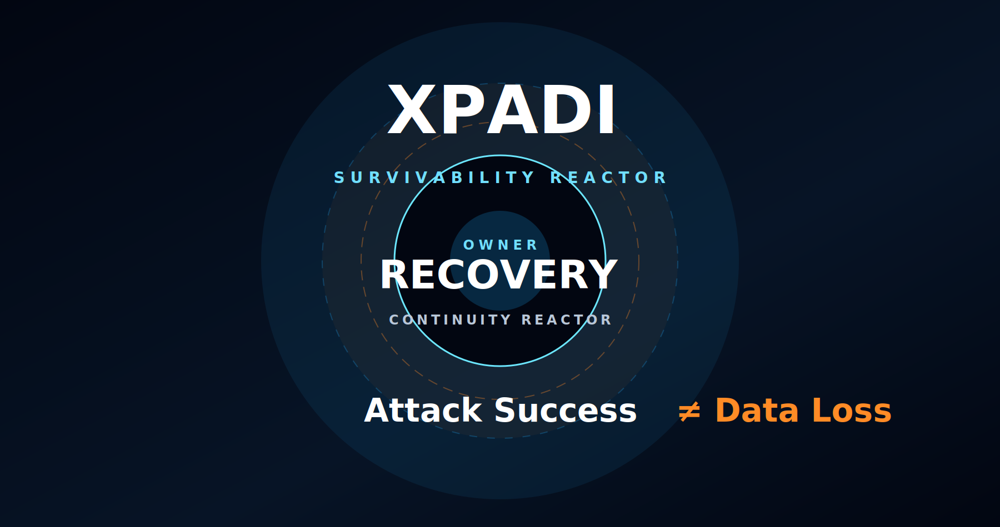

<div align="center">


# XPADI-SGDS™

## ATTACK SUCCESS ≠ DATA LOSS

### Survivability-Governed Data Systems

A cinematic survivability infrastructure ecosystem exploring deterministic reconstruction, recovery readiness, continuity intelligence, fragment-aware recovery, and post-damage operational resilience.

<br/>

[](https://raajmandale.github.io/XPADI-SGDS/demo/)

[](https://github.com/raajmandale/XPADI-ProofCheck)

[](https://github.com/raajmandale/dfg-demo-lab)

[](https://github.com/raajmandale)

<br/><br/>

| Research Surface | Link |
|---|---|
| ⚡ Live Reactor Surface | https://raajmandale.github.io/XPADI-SGDS/demo/ |
| 🧠 XPADI-ProofCheck™ | https://github.com/raajmandale/XPADI-ProofCheck |
| 🛰️ XPADI_Proof_Engine_V1 | https://github.com/raajmandale/XPADI_Proof_Engine_V1 |
| 🌌 digital-lifeline | https://github.com/raajmandale/digital-lifeline |
| 🤖 XLifelineAI | https://github.com/raajmandale/XLifelineAI |
| 🧬 dfg-demo-lab | https://github.com/raajmandale/dfg-demo-lab |

</div>

---

# 🧠 What is XPADI-SGDS?

XPADI-SGDS™ is a public survivability infrastructure surface.

It is not a backup tool.  
It is not a storage platform.  
It is not a traditional cybersecurity dashboard.

XPADI-SGDS explores a deeper infrastructure question:

> What survives after damage?

The ecosystem direction focuses on:

- deterministic reconstruction
- survivability intelligence
- continuity-aware recovery
- fragment-aware infrastructure
- post-damage operational resilience
- recovery-readiness visibility
- infrastructure continuity under pressure
- proof-oriented survivability systems

---

# ⚡ Core Thesis

```text
Modern infrastructure still assumes recovery
will work when pressure arrives.

XPADI-SGDS explores what happens after:

- corruption
- deletion
- ransomware
- dependency collapse
- continuity failure
- infrastructure damage

CORE SIGNAL:

ATTACK SUCCESS ≠ DATA LOSS
🛰️ Live Reactor Surface
<div align="center">
⚡ Cinematic Operational Surface
OPEN LIVE REACTOR
</div>

The reactor surface simulates:

continuity telemetry
deterministic reconstruction atmosphere
survivability flow
infrastructure signal intelligence
ecosystem continuity mapping
recovery pulse states
fragment graph visibility
operational continuity atmosphere
cinematic continuity infrastructure
🌐 XPADI Master Ecosystem
Surface	Role
XPADI-SGDS™	Canonical survivability infrastructure root surface
XPADI-ProofCheck™	Recovery Intelligence & Survivability Proof surface
XPADI_Proof_Engine_V1	Deterministic survivability proof engine
digital-lifeline	Origin continuity architecture seed
XLifelineAI	Runtime continuity & survivability intelligence
dfg-demo-lab	Deterministic Fragment Graph research layer
🧬 Ecosystem Architecture
<div align="center"> 

<br/><br/>

 </div>

XPADI-SGDS acts as the canonical public root layer connecting all survivability research surfaces into a unified continuity ecosystem.

⚡ Continuity Flow
<div align="center">  </div>
Phase	Purpose
DETECT	Identify continuity damage
SPLIT	Reduce fragile full-copy dependency
DISTRIBUTE	Remove single-point exposure
REBUILD	Deterministic reconstruction
VERIFY	Generate survivability proof
CONTINUE	Operational continuity recovery
🧠 Infrastructure Reality

Modern infrastructure still contains hidden continuity assumptions.

Replication alone can duplicate damage.

Cloud accessibility alone does not guarantee deterministic reconstruction.

Checksums verify integrity — not survivability.

Backups can still collapse under operational pressure.

XPADI-SGDS explores continuity after infrastructure failure.

🌌 Atmospheric Identity

XPADI-SGDS is designed to feel like:

a living survivability reactor
a continuity intelligence system
a cinematic operational environment
a deterministic recovery atmosphere
a public research artifact
an alive cyber infrastructure layer

—not a traditional landing page.

🛰️ Research Identity Layer

XPADI-SGDS connects into a broader public continuity ecosystem through:

GitHub
Zenodo
SSRN
ORCID
Wikidata
survivability research artifacts
continuity infrastructure surfaces
deterministic reconstruction research
⚡ Public Direction

XPADI-SGDS currently focuses on:

survivability research
continuity visualization
deterministic reconstruction philosophy
infrastructure continuity atmosphere
recovery-readiness visibility
proof-oriented continuity systems
cinematic operational identity
public survivability infrastructure
🌌 Founder
Raaj Mandale

Systems Architect
AI Infrastructure • Survivability Systems • Runtime Intelligence

GitHub: https://github.com/raajmandale

<div align="center">

Continuity is the Future. Survivability is the Foundation.

</div> ```