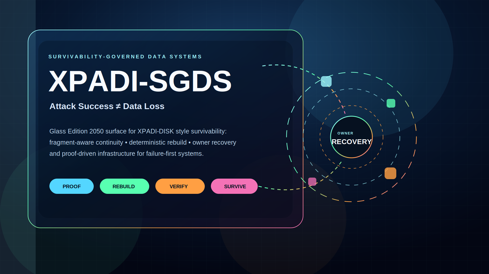
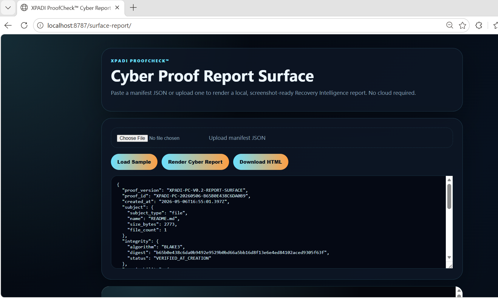
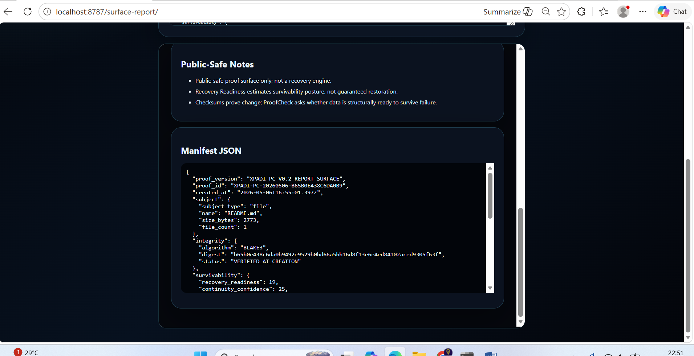
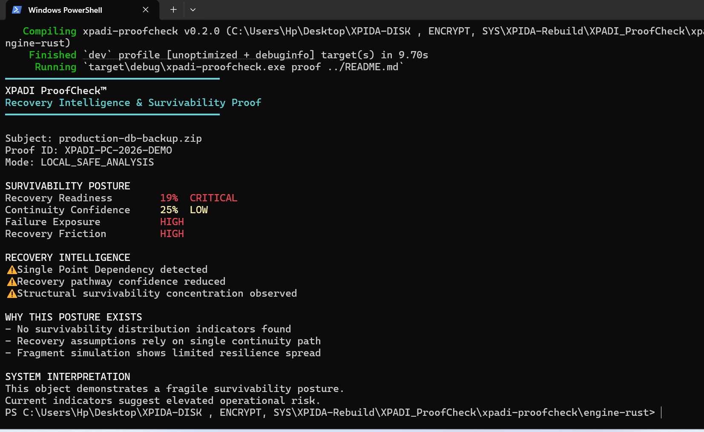
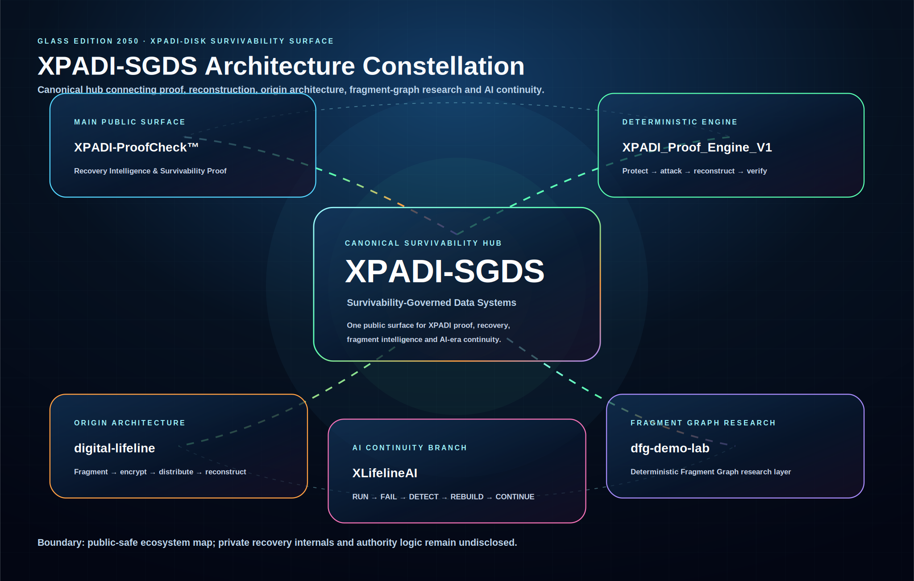
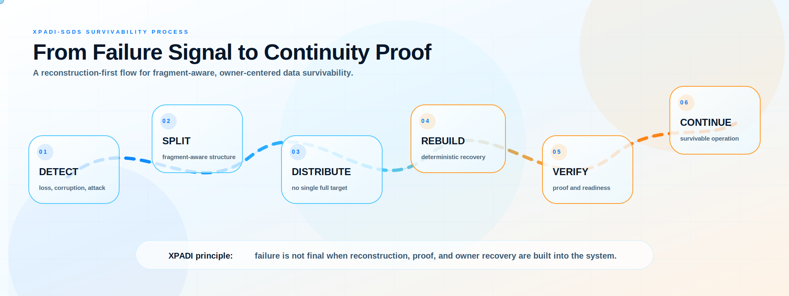

<div align="center">



# XPADI-SGDS™

## ATTACK SUCCESS ≠ DATA LOSS

### Survivability-Governed Data Systems

A public survivability infrastructure and continuity research surface exploring deterministic reconstruction, continuity intelligence, fragment-aware recovery, operational resilience, and post-damage infrastructure survivability.

<br>

[](https://raajmandale.github.io/XPADI-SGDS/demo/)
[](https://xpadi.com/proofcheck/)
[](https://github.com/raajmandale/XPADI-ProofCheck)
[](https://github.com/raajmandale/XPADI_Proof_Engine_V1)
[](https://github.com/raajmandale/dfg-demo-lab)
[](https://raajmandale.in)

</div>

---
---

# 🌐 SGDS Ecosystem Surfaces

| Surface | Purpose | Link |
|---|---|---|
| XPADI-SGDS | Canonical survivability ecosystem root | https://github.com/raajmandale/XPADI-SGDS |
| XPADI Proof Engine | Runtime continuity reactor | https://raajmandale.github.io/XPADI_Proof_Engine_V1/ |
| Digital Lifeline | Survivability architecture narrative | https://github.com/raajmandale/digital-lifeline |
| XLifelineAI | AI-native continuity & self-healing runtime | https://github.com/raajmandale/XLifelineAI |
| XPADI-ProofCheck | Recovery intelligence surface | https://xpadi.com/proofcheck/ |
| Research Paper | SGDS architecture & theory | https://zenodo.org/records/19500143 |

---
# 🧠 What is XPADI-SGDS?

XPADI-SGDS™ is a public survivability infrastructure surface.

It is NOT:

- a backup tool
- a storage platform
- a ransomware remover
- a traditional cybersecurity dashboard
- a cloud sync platform

XPADI-SGDS explores a deeper infrastructure problem:

> What survives after infrastructure damage?

The project investigates continuity systems designed around:

- deterministic reconstruction
- survivability intelligence
- continuity-aware recovery
- fragment-aware infrastructure
- recovery-readiness visibility
- post-damage operational resilience
- proof-oriented recovery systems
- continuity under operational pressure

---

# 🏗 Infrastructure Model

XPADI-SGDS explores survivability-oriented infrastructure through five operational layers:

| Layer | Function |
|---|---|
| Detection Layer | identifies corruption, deletion, continuity instability, and infrastructure damage |
| Fragment Layer | distributes survivability-aware fragments instead of relying on fragile full-copy assumptions |
| Reconstruction Layer | explores deterministic reconstruction pathways after operational failure |
| Verification Layer | produces recovery-readiness and survivability confidence signals |
| Continuity Layer | restores operational continuity after damage rather than only preventing attacks beforehand |

The system direction investigates how continuity infrastructure may behave when:

- replication fails
- storage becomes unavailable
- dependency paths collapse
- ransomware damages recovery chains
- operational infrastructure becomes unstable

XPADI-SGDS focuses on continuity after failure — not only prevention before failure.

---

# 📸 Proof Surface Screenshots

## 01 ▸ CLI Engine Execution



---

## 02 ▸ Recovery Intelligence & Public-Safe Proof Layer



---

## 03 ▸ Cyber Proof Report Surface



---

# ⚡ Core Thesis

Modern infrastructure still assumes recovery will work when pressure arrives.

XPADI-SGDS explores survivability after:

- corruption
- deletion
- ransomware damage
- continuity collapse
- dependency failure
- infrastructure fragmentation
- operational disruption

<div align="center">

# ATTACK SUCCESS ≠ DATA LOSS

</div>

---

# ⚡ Live Reactor Surface

[](https://raajmandale.github.io/XPADI-SGDS/demo/)

The XPADI-SGDS reactor surface simulates:

- continuity telemetry
- deterministic reconstruction atmosphere
- survivability signal flow
- recovery pulse states
- ecosystem continuity mapping
- infrastructure continuity visualization
- fragment graph visibility
- operational resilience posture
- cinematic continuity infrastructure

---
# 📊 Benchmark & Recovery Signals

XPADI-SGDS includes public-safe survivability benchmark demonstrations covering:

- reconstruction posture
- recovery-readiness telemetry
- continuity confidence
- fragment survivability signals
- operational failure exposure
- proof-oriented infrastructure interpretation

---

## 🧪 Recovery Benchmark Snapshot

| Signal | State |
|---|---|
| Recovery Readiness | 19% |
| Continuity Confidence | 25% |
| Failure Exposure | HIGH |
| Recovery Friction | HIGH |
| Fragment Survivability Spread | LIMITED |
| Integrity Verification | BLAKE3 VERIFIED |

---

## ⚠ Recovery Intelligence

- Single-point dependency detected
- Recovery pathway confidence reduced
- Structural survivability concentration observed
- Fragment survivability spread is limited
- Operational continuity posture is fragile

---
## 🛰 Benchmark Interpretation

The benchmark surface demonstrates how survivability posture may degrade when:

- reconstruction pathways depend on fragile structures
- continuity distribution remains limited
- operational recovery relies on single infrastructure chains
- fragment survivability visibility is insufficient

XPADI-SGDS explores infrastructure survivability after failure rather than assuming recovery success by default.

---
## 🔗 Full Benchmark Documentation

[👉 OPEN RECOVERY SIGNAL DOCUMENTATION](docs/RECOVERY_SIGNALS.md)
---
### 🧬 Ecosystem Architecture

<div align="center">



</div>

XPADI-SGDS acts as the canonical public root layer connecting survivability research surfaces into one continuity ecosystem.

The ecosystem separates:

- proof surfaces
- reconstruction engines
- continuity research
- runtime survivability intelligence
- fragment graph experimentation
- public infrastructure visualization

without exposing:

- protected recovery internals
- authority logic
- proprietary survivability mechanisms

---
### ⚙ Living Reconstruction Flow

<div align="center">



</div>

| Phase | Purpose |
|---|---|
| DETECT | Identify continuity damage and infrastructure instability |
| SPLIT | Reduce fragile full-copy dependency |
| DISTRIBUTE | Remove single-point exposure |
| REBUILD | Deterministic reconstruction logic |
| VERIFY | Generate survivability proof confidence |
| CONTINUE | Recover operational continuity |

---

# 🛰 Research & Infrastructure Direction

XPADI-SGDS currently explores:

- survivability-oriented infrastructure
- deterministic reconstruction philosophy
- continuity visualization systems
- recovery-readiness telemetry
- proof-oriented continuity systems
- fragment-aware recovery structures
- infrastructure continuity under failure
- operational resilience signaling
- continuity intelligence surfaces

---

# 🌌 Infrastructure Reality

Modern infrastructure still contains hidden continuity assumptions.

Replication can duplicate damage.

Cloud accessibility does not guarantee deterministic reconstruction.

Checksums verify integrity — not survivability.

Backups can still collapse under operational pressure.

XPADI-SGDS explores continuity after infrastructure failure rather than prevention alone.

---

# 🌐 Public Research Identity

| Identity Surface | Purpose | Link |
|---|---|---|
| GitHub | Open infrastructure & code surfaces | https://github.com/raajmandale |
| Zenodo | DOI-backed research records | https://zenodo.org |
| ORCID | Research identity layer | https://orcid.org/0009-0005-9810-1655 |
| SSRN | Public paper distribution | https://papers.ssrn.com |
| Wikidata | Public knowledge graph identity | https://www.wikidata.org |
| Founder Website | Ecosystem & research hub | https://raajmandale.in |

---

# 🧠 Design Philosophy

XPADI-SGDS is intentionally designed to feel like:

- a living survivability reactor
- a continuity intelligence layer
- a cinematic operational environment
- a deterministic recovery atmosphere
- an alive infrastructure artifact
- a research-driven cyber system

—not a traditional landing page.

---

# ⚖ Repository Purpose

This repository exists as:

- a public survivability infrastructure surface
- a continuity research presentation layer
- a cinematic infrastructure demonstration
- a continuity philosophy artifact
- an ecosystem navigation hub
- a public-facing operational reactor

It does NOT expose:

- protected reconstruction mechanisms
- private recovery internals
- authority logic
- proprietary survivability methods
- protected operational infrastructure

---

# 📁 Repository Structure

```text
XPADI-SGDS/
│
├── assets/
│   ├── screenshots/
│   └── svg/
│       ├── hero.svg
│       ├── architecture.svg
│       └── process-flow.svg
│
├── demo/
│   └── index.html
│
├── docs/
│   └── BENCHMARK.md
│
├── LICENSE
└── README.md
```

---

# 📜 License

MIT License

This repository is released under the MIT License for:

- public research visibility
- educational exploration
- continuity visualization
- survivability demonstrations
- infrastructure research presentation

---

# 🌌 Founder

## Raaj Mandale

Systems Architect  
AI Infrastructure • Survivability Systems • Runtime Intelligence

- 🌍 https://raajmandale.in
- 💻 https://github.com/raajmandale
- 🧾 https://orcid.org/0009-0005-9810-1655

---

<div align="center">

# ATTACK SUCCESS ≠ DATA LOSS

## Continuity is the Future. Survivability is the Foundation.

</div>
