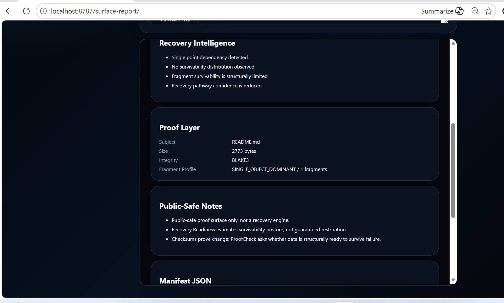

# 📊 XPADI-SGDS™ Benchmark Surface

## Survivability-Governed Data Systems  
### Public Research Benchmark & Recovery Intelligence Surface

---

# ⚡ Benchmark Purpose

This document demonstrates the operational behavior, recovery posture, and survivability characteristics of the XPADI-SGDS™ public research ecosystem.

The benchmark is intentionally designed as a:

- public-safe research layer
- continuity demonstration surface
- deterministic reconstruction simulation
- recovery intelligence experiment
- operational survivability proof environment

This is NOT a production recovery engine disclosure.

Private recovery internals, authority systems, and reconstruction mechanisms remain intentionally undisclosed.

---

# 🧠 Core Research Question

Most systems ask:

> “Can data be protected before failure?”

XPADI-SGDS asks:

> “Can continuity survive after failure already happened?”

---

# 🌐 Benchmark Environment

| Layer | Environment |
|---|---|
| Runtime | Local Windows Execution |
| Engine Surface | Rust CLI + HTML Surface |
| Proof Renderer | Local Browser Report |
| Mode | Public-Safe Demonstration |
| Connectivity | Offline-Compatible |
| Rendering | Static + Runtime Hybrid |
| Objective | Recovery Intelligence Visibility |

---

# ⚡ Benchmark Categories

| Benchmark | Purpose |
|---|---|
| Fragment Survivability | Distribution posture |
| Recovery Readiness | Structural continuity estimation |
| Recovery Confidence | Reconstruction confidence visibility |
| Failure Exposure | Single dependency visibility |
| Operational Continuity | Post-damage survivability posture |
| Proof Intelligence | Human-readable recovery interpretation |

---

# 📸 Benchmark Evidence

## 01 — CLI Proof Engine

Demonstrates:

- local proof execution
- survivability posture analysis
- continuity confidence scoring
- failure exposure visibility
- deterministic telemetry rendering

---

## 02 — Recovery Intelligence Layer

Demonstrates:

- structural survivability analysis
- recovery pathway visibility
- operational continuity interpretation
- fragment concentration awareness

---

## 03 — Proof Layer

Demonstrates:

- integrity telemetry
- public-safe reporting
- manifest visibility
- proof-state rendering
- continuity posture explanation

---

## 04 — Cyber Report Surface

Demonstrates:

- browser-based recovery intelligence rendering
- local survivability analysis
- infrastructure continuity visualization
- operator-readable proof interpretation

---

# 📊 Example Survivability Output

| Signal | State |
|---|---|
| Recovery Readiness | 19% |
| Continuity Confidence | 25% |
| Failure Exposure | HIGH |
| Recovery Friction | HIGH |
| Integrity Drift | 0.00% |

---

# ⚠️ Recovery Intelligence Interpretation

The benchmark intentionally demonstrates how XPADI-ProofCheck™ interprets survivability posture.

Example findings:

- Single point dependency detected
- Recovery pathway confidence reduced
- Structural survivability concentration observed
- Limited continuity spread detected

This layer focuses on:

> continuity intelligence rather than checksum-only validation.

---

# 🧬 XPADI-SGDS Ecosystem Relationship

| Surface | Role |
|---|---|
| XPADI-SGDS™ | Canonical survivability infrastructure surface |
| XPADI-ProofCheck™ | Recovery intelligence & survivability proof |
| XPADI_Proof_Engine_V1 | Deterministic proof engine |
| digital-lifeline | Origin continuity architecture |
| XLifelineAI | Runtime continuity intelligence |
| dfg-demo-lab | Deterministic fragment graph research |

---

# 🌍 Design Philosophy

XPADI-SGDS is intentionally designed to feel like:

- a living survivability reactor
- a continuity intelligence layer
- an operational recovery atmosphere
- a deterministic resilience surface
- an infrastructure continuity artifact

The objective is not visual decoration alone.

The objective is:

> making continuity visible.

---

# ⚖️ Public-Safe Boundary

XPADI-SGDS is a public research surface.

The repository intentionally does NOT expose:

- real recovery internals
- authority-layer logic
- private reconstruction methods
- protected survivability pipelines
- proprietary continuity orchestration

This repository exists as:

- a public continuity research layer
- a survivability visualization surface
- a deterministic reconstruction atmosphere
- an infrastructure resilience demonstration

---

# 👤 Founder

**Raaj Mandale**  
Founder & Systems Architect  
AI Infrastructure • Cyber Survivability • Runtime Systems

🌐 https://raajmandale.in

---

# 🔗 Research Surfaces

| Surface | Link |
|---|---|
| XPADI-SGDS™ | https://github.com/raajmandale/XPADI-SGDS |
| XPADI-ProofCheck™ | https://xpadi.com/proofcheck/ |
| XPADI Proof Engine | https://github.com/raajmandale/XPADI_Proof_Engine_V1 |
| XLifelineAI | https://github.com/raajmandale/XLifelineAI |
| dfg-demo-lab | https://github.com/raajmandale/dfg-demo-lab |
| digital-lifeline | https://github.com/raajmandale/digital-lifeline |

---

# 🧠 Final Signal

> Attack success should not automatically become permanent operational loss.

XPADI-SGDS explores continuity after damage — not only prevention before it.